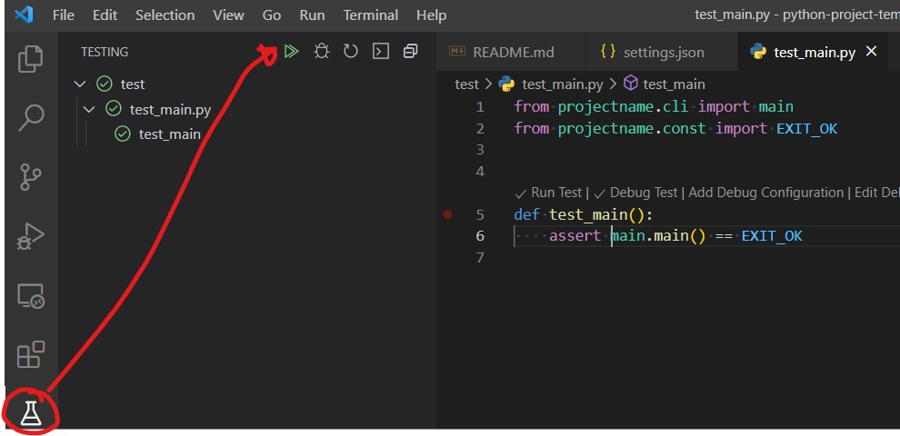

# Python project template

My very basic project template I like to use when bootstrapping a new Python project that has some kind of CLI interface.

## Contents

- A basic directory structure that allows us to run the project as a module with `python -m projectname`
- Flake8 linting (extended with `flake8-bugbear`)
- Black formatter
- Pytest framework
- VSCode configuration:
  - `settings.json` that configures Python executable to `.venv` (create it yourself with `python -m venv .venv`) and configures `pytest`, `flake8` and `black`.
  - `launch.json` with configurations for debugging module and currently active file

## Run tests

Run tests either manually

```bash
pytest
```

Or, let VSCode handle it by going to the test tab and running/debugging tests from there. VSCode will mark all failed tests with a red underline directly in the source code. Read more in [VSCode docs](https://code.visualstudio.com/docs/python/testing).



## Run linter

Run linting either manually

```bash
flake8 projectname/
```

VSCode is also configured to lint and format automatically on save.
